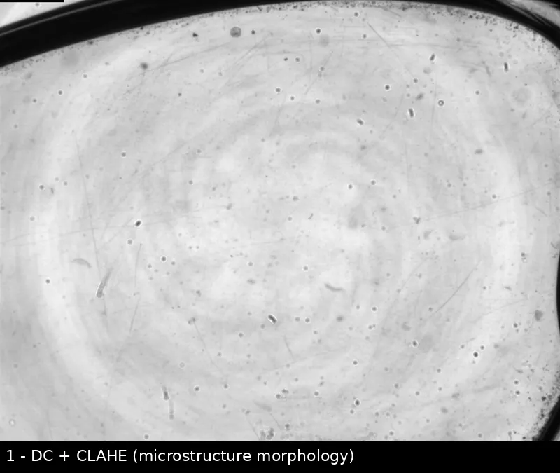

# Microlens Schlieren Toolkit

Classical, dependency-light inspection for defocus / phase-shift microlens
imaging. Two pillars:

1. **Microstructure morphology** — five-step phase-shifting recovers wrapped
   phase, DC, and modulation amplitude from fringe (schlieren-style) images.
2. **Defect detection** — a 28-frame threshold baseline segments the lens and
   classifies **scratches / pits / crashes / anomalies**, exporting masks,
   COCO annotations, and overlays.

<p align="center">
  
</p>

> Learning-based ("intelligent") detection is developed in a separate project.
> This package is the **classical morphology / defect front end** intended to
> plug into a larger microstructure-lens recognition system.

---

## Install

```bash
python -m venv .venv && source .venv/bin/activate   # Windows: .venv\Scripts\activate
pip install -e .          # add ".[dev]" for tests + linters
```

CLI entry point: `microlens-defects` (package `microlens_defects`, v0.4.0).

## Quickstart

**Defect detection** (single sample):

```bash
microlens-defects detect --glasses 2006 --side left --grating cycle \
  --db microlens_metadata.db --img-root organized_tiffs \
  --save-dir defect_detection_outputs
```

Batch over the database (use `--limit` to cap; passing only `--limit` enables
`--all` automatically; `--all` cannot be combined with single-sample options):

```bash
microlens-defects detect --all --limit 10 \
  --db microlens_metadata.db --img-root organized_tiffs \
  --save-dir defect_detection_outputs \
  --config configs/detect_threshold.yaml
```

**Microstructure morphology** (five-step phase-shifting, 5 fringe frames):

```bash
microlens-defects phase5 ./five_frames --pattern "*.tif" --output phase_result.npz
```

## Pipeline & outputs

Threshold baseline (28-frame stack; per-pixel DC mean and temporal std):

1. CLAHE on inverted DC → adaptive threshold + morphology → coarse global mask.
2. Gaussian density threshold → **crash** (large damaged regions).
3. Geometry / prominence rules → **scratch** (elongated, merged), **pit**, **anomaly**.
4. Export full-image mask, COCO annotations, and an overlay.

Per sample, written to `save-dir/<glasses>_<side>_<grating>/`:

| File | Content |
| --- | --- |
| `<tag>_dc_clahe.png` | DC + CLAHE base image (morphology) |
| `<tag>_global_mask.png` | binary global mask |
| `<tag>_overlay.png` | classified defect overlay |
| `<tag>_annotations.json` | COCO annotations |

Plus `save-dir/metadata_summary.csv|jsonl` (per-sample stats + parameter snapshot).
COCO categories: `scratch(1)`, `pit(2)`, `crash(3)`, `anomaly(4)`.

The five-step phase command saves a compressed NPZ with `phase`, `dc`,
`amplitude`, and `mask` arrays. See the algorithm in
[features/five_step_phase.py](src/microlens_defects/features/five_step_phase.py).

## Key parameters

Tune via [configs/detect_threshold.yaml](configs/detect_threshold.yaml) or CLI
overrides; the resolved parameters are logged and stored in the metadata snapshot.

- Threshold / morphology: `adaptive_block`, `adaptive_c`, `open_kernel`, `close_kernel`
- Density (crash): `density_kernel_ratio`, `density_threshold`, `dense_min_area`
- Scratch: `scratch_min_len`, `scratch_min_aspect`, extend / merge parameters
- Prominence: `prominence_min_value` (applied to pit / anomaly only)

## Data conventions

- SQLite table `images` with at least: `glasses_id`, `lens_side`,
  `grating_type`, `phase_index` (0..28), `file_path`.
- `--img-root` (default `organized_tiffs`): resolved as a relative path first,
  then tried as an absolute path.

## Project layout

```
src/microlens_defects/
├── data/db.py              # SQLite + image-root stack loader
├── detection/              # threshold defect detector
│   ├── base.py             # BaseDetector / DetectionResult interface
│   ├── params.py           # parameters + validation
│   ├── features.py         # feature extraction
│   ├── masks.py            # mask building + component classification
│   ├── rendering.py        # overlay / COCO / metadata export
│   └── threshold.py        # ThresholdDetector + run_threshold_detection
├── features/five_step_phase.py
├── cli/app.py              # Typer CLI (detect, phase5)
├── logging.py · exceptions.py
configs/   docs/   tests/   scripts/make_demo_webp.py
```

## Development

```bash
pip install -e ".[dev]"
pytest -q
ruff check src tests && ruff format --check src tests
```

Docs: [docs/index.md](docs/index.md) · architecture, API guide, troubleshooting.
License: [LICENSE](LICENSE).
